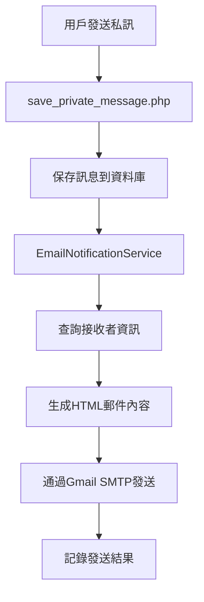
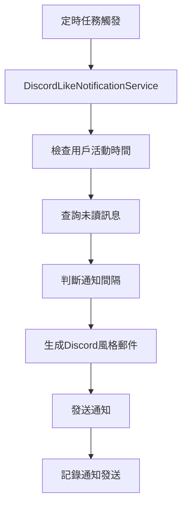

# Gmail 通知系統運作說明

## 📧 系統概述

康寧大學聊天系統的 Gmail 通知功能包含兩個主要部分：

1. **即時私訊通知** - 當有人發送私訊時立即發送郵件通知
2. **Discord 風格定期通知** - 當用戶長時間未查看聊天時發送提醒

## 🔧 系統架構

### 核心文件結構
```
backend/
├── services/
│   ├── email_notification.php          # 主要郵件服務類
│   └── discord_like_notification.php   # Discord風格通知服務
├── config/
│   └── email_config.php                # 郵件配置管理
└── PHPMailer/                          # 郵件發送庫

frontend/
├── chat/
│   ├── save_private_message.php        # 私訊保存API（觸發通知）
│   └── load_private_messages.php       # 載入私訊API
└── email_test.php                      # 測試頁面
```

## 🚀 運作流程

### 1. 即時私訊通知流程



**詳細步驟：**

1. **觸發點**：用戶在聊天界面發送私訊
2. **API處理**：`save_private_message.php` 接收訊息
3. **資料庫操作**：將訊息保存到 `private_chat_history` 表
4. **通知服務**：創建 `EmailNotificationService` 實例
5. **用戶查詢**：從 `user` 表獲取接收者資訊
6. **郵件生成**：創建 HTML 格式的通知郵件
7. **SMTP發送**：通過 Gmail SMTP 發送郵件
8. **結果記錄**：記錄發送成功或失敗

### 2. Discord 風格定期通知流程



**通知間隔設定：**
- 1小時未查看
- 6小時未查看  
- 24小時未查看
- 3天未查看
- 1週未查看

## 📋 配置要求

### 1. Gmail 設定

**必要配置：**
```php
// backend/config/email_config.php
$email_config = [
    'smtp_host' => 'smtp.gmail.com',
    'smtp_port' => 587,
    'smtp_username' => 'your-email@gmail.com',
    'smtp_password' => 'your-app-password',  // Gmail應用程式密碼
    'sender_email' => 'your-email@gmail.com',
    'sender_name' => '康寧大學聊天系統',
];
```

**Gmail 應用程式密碼設定：**
1. 登入 Gmail 帳戶
2. 前往「Google 帳戶」→「安全性」
3. 啟用「兩步驟驗證」
4. 生成「應用程式密碼」
5. 使用生成的密碼（非登入密碼）

### 2. 資料庫表結構

**必要表格：**
```sql
-- 私訊歷史記錄
CREATE TABLE private_chat_history (
    id INT AUTO_INCREMENT PRIMARY KEY,
    from_user VARCHAR(255) NOT NULL,
    to_user VARCHAR(255) NOT NULL,
    message TEXT NOT NULL,
    role VARCHAR(50) DEFAULT '用戶',
    timestamp TIMESTAMP DEFAULT CURRENT_TIMESTAMP
);

-- 用戶活動記錄
CREATE TABLE user_activity (
    username VARCHAR(255) PRIMARY KEY,
    last_chat_check TIMESTAMP,
    last_seen TIMESTAMP DEFAULT CURRENT_TIMESTAMP
);

-- 通知發送記錄
CREATE TABLE notification_sent_log (
    id INT AUTO_INCREMENT PRIMARY KEY,
    username VARCHAR(255) NOT NULL,
    notification_type VARCHAR(50) NOT NULL,
    sent_at TIMESTAMP DEFAULT CURRENT_TIMESTAMP,
    email_sent BOOLEAN DEFAULT FALSE
);
```

## 🎨 郵件格式

### 1. 即時私訊通知格式

**HTML 結構：**
- 康寧大學品牌色彩主題
- 發送者資訊顯示
- 訊息內容預覽
- 直接回覆按鈕
- 時間戳記

**範例內容：**
```html
📩 您有新的私訊來自 張老師

親愛的 李同學，

您收到了一條新的私訊：

來自：張老師
訊息內容：請記得明天交作業
發送時間：2025-01-27 14:30:00

[立即回覆] 按鈕
```

### 2. Discord 風格通知格式

**特色：**
- Discord 品牌色彩（#5865F2）
- 未讀訊息數量顯示
- 訊息預覽列表
- 時間間隔提醒

**範例內容：**
```html
🔔 您有未讀消息

親愛的 李同學，

您已經 6小時 沒有查看聊天系統了！
您有 3 條未讀消息等待您的回覆。

📨 未讀消息預覽：
• 張老師 (14:30): 請記得明天交作業
• 王助教 (15:45): 課程資料已上傳
• 陳同學 (16:20): 一起討論報告嗎？

[立即查看消息] 按鈕
```

## 🧪 測試方法

### 1. 使用測試頁面
```
訪問：http://100.79.58.120/frontend/email_test.php
```

**測試功能：**
- ✅ 配置狀態檢查
- ✅ 基本郵件發送測試
- ✅ 私訊通知郵件測試
- ✅ Discord 風格通知測試

### 2. 手動測試步驟

1. **配置檢查**：
   ```bash
   # 檢查配置狀態
   curl -X POST http://100.79.58.120/frontend/email_test.php \
        -d "action=check_config"
   ```

2. **基本郵件測試**：
   ```bash
   # 發送測試郵件
   curl -X POST http://100.79.58.120/frontend/email_test.php \
        -d "action=test_basic_email&test_email=your-email@example.com"
   ```

3. **私訊通知測試**：
   ```bash
   # 測試私訊通知
   curl -X POST http://100.79.58.120/frontend/email_test.php \
        -d "action=test_private_message&test_email=your-email@example.com&from_name=測試用戶&message_content=測試訊息"
   ```

## 🔄 自動化設定

### 1. 定時任務設定

**Linux Cron 設定：**
```bash
# 每小時檢查一次未讀通知
0 * * * * /usr/bin/php /path/to/backend/services/discord_like_notification.php

# 每6小時檢查一次
0 */6 * * * /usr/bin/php /path/to/backend/services/discord_like_notification.php
```

**Windows 工作排程器：**
1. 開啟「工作排程器」
2. 建立基本工作
3. 設定觸發程序（每小時）
4. 設定動作（執行 PHP 腳本）

### 2. 系統服務整合

**systemd 服務範例：**
```ini
[Unit]
Description=Kang Ning Chat Notification Service
After=network.target

[Service]
Type=simple
User=www-data
ExecStart=/usr/bin/php /path/to/backend/services/discord_like_notification.php
Restart=always
RestartSec=3600

[Install]
WantedBy=multi-user.target
```

## 🛠️ 故障排除

### 常見問題

1. **郵件發送失敗**
   - 檢查 Gmail 應用程式密碼
   - 確認 SMTP 設定正確
   - 檢查防火牆設定

2. **通知重複發送**
   - 檢查 `notification_sent_log` 表
   - 確認定時任務設定
   - 檢查用戶活動記錄

3. **HTML 格式問題**
   - 檢查郵件客戶端設定
   - 確認 UTF-8 編碼
   - 測試不同郵件客戶端

### 日誌檢查

**PHP 錯誤日誌：**
```bash
tail -f /var/log/php_errors.log
```

**應用程式日誌：**
```bash
tail -f /var/log/apache2/error.log
```

**自定義日誌：**
```php
// 在代碼中添加日誌記錄
error_log("郵件發送成功: $to_email");
error_log("郵件發送失敗: " . $error_message);
```

## 📊 監控與統計

### 1. 發送統計

**查詢發送記錄：**
```sql
-- 今日發送統計
SELECT 
    DATE(sent_at) as date,
    notification_type,
    COUNT(*) as count,
    SUM(email_sent) as success_count
FROM notification_sent_log 
WHERE DATE(sent_at) = CURDATE()
GROUP BY DATE(sent_at), notification_type;
```

### 2. 用戶活動分析

**用戶活躍度查詢：**
```sql
-- 用戶最後活動時間
SELECT 
    username,
    last_chat_check,
    last_seen,
    TIMESTAMPDIFF(HOUR, last_chat_check, NOW()) as hours_since_last_check
FROM user_activity 
ORDER BY last_chat_check DESC;
```

## 🔒 安全性考量

### 1. 郵件安全

- 使用 TLS/SSL 加密連線
- 驗證發送者身份
- 防止郵件濫用
- 設定發送頻率限制

### 2. 資料保護

- 加密敏感資訊
- 定期清理舊記錄
- 備份重要資料
- 監控異常活動

## 📈 效能優化

### 1. 郵件佇列

**建議實作：**
```php
// 使用 Redis 或資料庫佇列
class EmailQueue {
    public function addToQueue($emailData) {
        // 將郵件加入佇列而非立即發送
    }
    
    public function processQueue() {
        // 批次處理佇列中的郵件
    }
}
```

### 2. 快取機制

**用戶活動快取：**
```php
// 使用 Redis 快取用戶活動
$redis->setex("user_activity:$username", 3600, json_encode($activityData));
```

## 🎯 未來擴展

### 1. 多語言支援

- 根據用戶偏好選擇語言
- 動態載入語言包
- 支援繁簡體中文

### 2. 個性化設定

- 用戶自定義通知頻率
- 選擇性通知類型
- 靜音時段設定

### 3. 進階功能

- 郵件模板編輯器
- A/B 測試功能
- 詳細分析報表
- 整合其他通知管道（SMS、推播）

---

## 📞 技術支援

如有問題，請聯繫：
- 系統管理員：admin@knu.edu.tw
- 技術支援：tech@knu.edu.tw
- 文檔更新：2025-01-27


